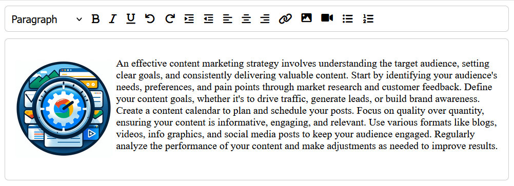

# HREditor
HREditor is a lightweight JavaScript plugin designed to enhance the functionality of HTML text editors by providing a customizable toolbar with various formatting options and media insertion capabilities.

## Features

- **Rich Text Editing:** Format text with bold, italic, underline, and more.
- **Media Insertion:** Easily insert images and videos into the editor.
- **Undo/Redo:** Conveniently undo or redo changes made to the content.
- **Lists:** Create ordered or unordered lists effortlessly.
- **Link Creation:** Insert hyperlinks with ease.
- **Customizable Toolbar:** Configure the toolbar according to your preferences.

## Demo: https://hr-editor.tiiny.site/



## Installation

To install HREditor, follow these steps:

1. **Include the Plugin Script & CSS:** Add the HREditor JavaScript & CSS file to your HTML document.

```html

<link rel="stylesheet" type="text/css" href="css/hr-editor.min.css">
<script type="application/javascript" src="js/hr-editor.min.js"></script>
```
2. **Add fontawesome:** Since HREditor uses fontawesome 6 icons, include them
```html
<link rel="stylesheet" href="https://cdnjs.cloudflare.com/ajax/libs/font-awesome/6.0.0-beta3/css/all.min.css">
```
3. **Create HTML Container:** Define a container element where you want the editor to be displayed.
```html
<div id="editor-container"></div>
```
4. **Initialize the Editor:** Initialize the editor by calling the `init` function with the container element.
```javascript
const container = document.getElementById('editor-container');
const editor = HREditor.init(container);
```
## Options
You can customize the editor by passing options to the `init` function. Here are some available options:
```javascript
const config = {
    toolbar: [
        'heading', 'bold', 'italic', 'underline',
        'undo', 'redo', 'indent', 'outdent',
        'justifyLeft', 'justifyCenter', 'justifyRight',
        'createLink', 'insertImage', 'insertVideo', 'unorderedList', 'orderedList'
    ],
    imageHandler: (image) => { 
        console.log('image...', image);
        // do something with image
        editor.insertImage('URL_OF_IMAGE');
    },
    videoHandler: (video) => { 
        console.log('video...', video);
        // do something with video
        editor.insertVideo('URL_OF_VIDEO');
    },
};
const editor = HREditor.init(container, config);
```
Listen for changes in the editor using `onChange` event
```javascript
editor.onChange(content => { console.log('Updated content...', content) });
```
Get the updated content whenever needed
```javascript
editor.getContent();
```
Initialize with content / set content in editor
```javascript
editor.setContent('YOUR_HTML_CONTENT');
```

Developed by <a href="https://hassanraza.net">Hassan Raza</a>